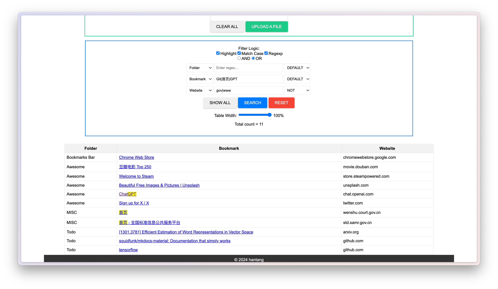

# bookmark-search

Just upload a bookmark file (html format) exported from browsers
or any html contained a `<table>`,
[this site](https://hantang.github.io/bookmark-search) will list
all bookmarks as a table format. Then you can filter the table
data with highlight, match case, and regular expression.

